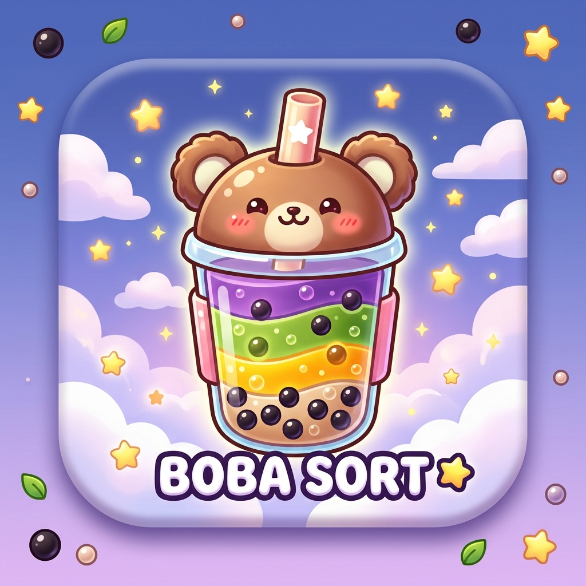
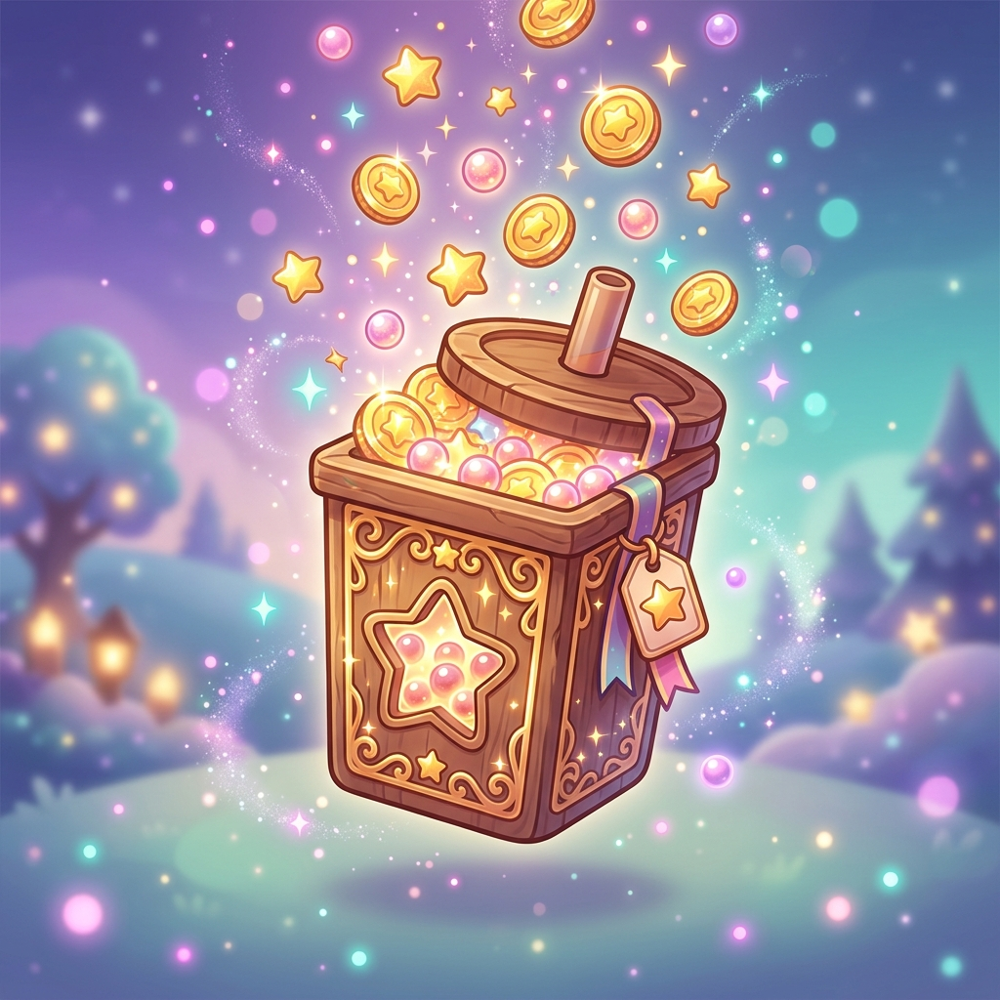

# 🧋 Boba Sort: Fluid Straw Puzzle

<p align="center">
  
</p>

<p align="center">
  <strong>Sort colors, stack boba pearls, and build your dream cafe in this cozy ASMR puzzle game!</strong>
</p>

<p align="center">
  
</p>

---

## 🌸 Welcome to Boba Sort!

Indulge in a sweet, relaxing brain-teaser! **Boba Sort** blends classic color-sorting logic with the cozy aesthetics of a cartoon bubble tea shop. Transfer flavored milks, layer chewy tapioca boba pearls, and complete your orders to earn coins and expand your catalog of custom cups, straws, and cozy shop decorations!

Whether you need a quick mental break or a peaceful daily routine, **Boba Sort** is your go-to escape.

---

## ✨ Key Features

### 1. The LIFO Straw Buffer 🥤
Unlike other sorting games, you don't just pour back and forth. You use a **2-segment straw** that acts as a LIFO (Last-In, First-Out) stack buffer! 
* Hold, swap, and plan your moves using the straw.
* Execute advanced double-layer swaps or color-reversals to solve complex grids!

<p align="center">
  
</p>

### 2. 5 Distinct Cozy Towns (Chapters) 🗺️
Embark on a scenic journey across **100 levels** mapped along winding rivers of brown sugar syrup:
* **Matcha Meadows** (Levels 1-20): Pastel green fields with wild matcha cream rivers.
* **Sakura Station** (Levels 21-40): Floating islands showered in falling cherry blossoms.
* **Coconut Coast** (Levels 41-60): Sun-drenched turquoise beaches and palm trees.
* **Taro Town** (Levels 61-80): Purple twilight peaks under starlit observatory skies.
* **Neon Nebula** (Levels 81-100): Cozy retro-cyber space docks and cosmic starships.

Each chapter features its own **custom gameplay backgrounds** and interactive separators where you unlock cute travel vehicles (like Blossom Balloons and Boba Cruise ferries)!

### 3. Customize Your Boba Cafe 🎨
Spend your hard-earned level completion coins in the shop to personalize your storefront facade:
* **Facade Naming**: Paint your custom business name directly on the wooden facade beam with realistic text shadows.
* **Cozy Decor Upgrades**: Hang trailing ivy plants, hang bedroom posters, or install a pulsing retro-neon "BOBA" sign.
* **Premium Skins**: Unlock cute Cat/Bear-ear cups, mason jars, and colorful patterned straws.

### 4. Solver-Backed 100% Solvability 🧠
No dead-ends or unsolvable boards! Every level is procedurally generated and verified backward by our solver, guaranteeing that a solution always exists.

### 5. Rich ASMR Audio & Combos 🎵
Satisfy your ears with immersive pouring and slurping sound effects. Make consecutive matches to activate the **Combo Badge** and hear pouring chimes that climb in pitch with your streak!

---

## 🚀 Tech Stack

* **Framework:** React Native + Expo (SDK 54)
* **Animation:** React Native Reanimated (Spring settle bounces, floating combo badges, and particle effects)
* **Sound Effects:** Expo AV
* **Monetization:** Google AdMob SDK + RevenueCat (In-App Purchases)
* **Persistence:** AsyncStorage (Offline-friendly local game progress)

---

## 🛠️ Installation & Development

To run the codebase locally in your development client:

1. **Clone the repository:**
   ```bash
   git clone https://github.com/itstoasti/bb-sorta.git
   cd bb-sorta
   ```

2. **Install dependencies:**
   ```bash
   npm install
   ```

3. **Start the development server:**
   ```bash
   npx expo start
   ```
   *Press `a` to run on an Android emulator/device or `i` to run on an iOS simulator.*

---

## 📄 Privacy Policy
Looking for the privacy policy for app store submissions? Read the full document here:
👉 **[Privacy Policy Page](https://itstoasti.github.io/bb-sorta/privacy.html)**

---
<p align="center">
  Created with ♥ by <strong>deanfieldz</strong>. Happy Sorting! 🧋✨
</p>
